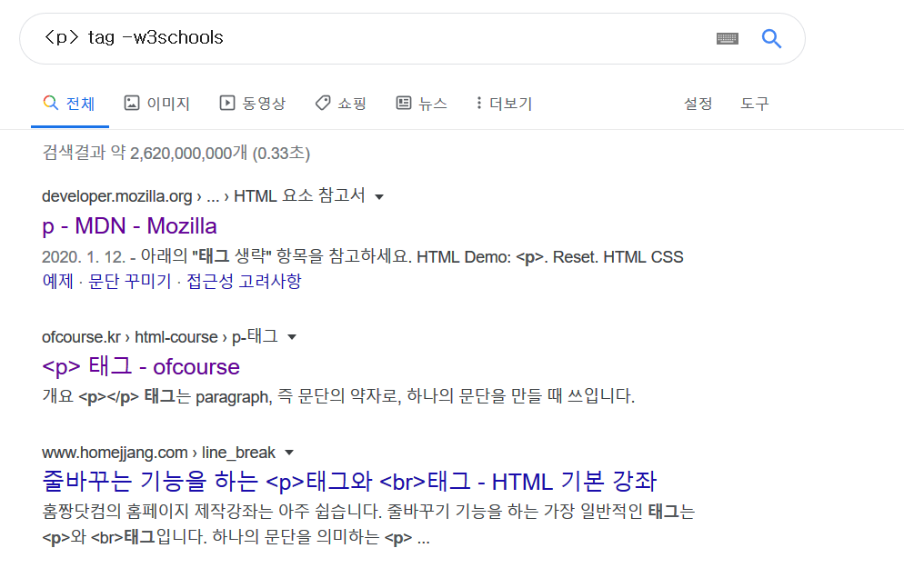
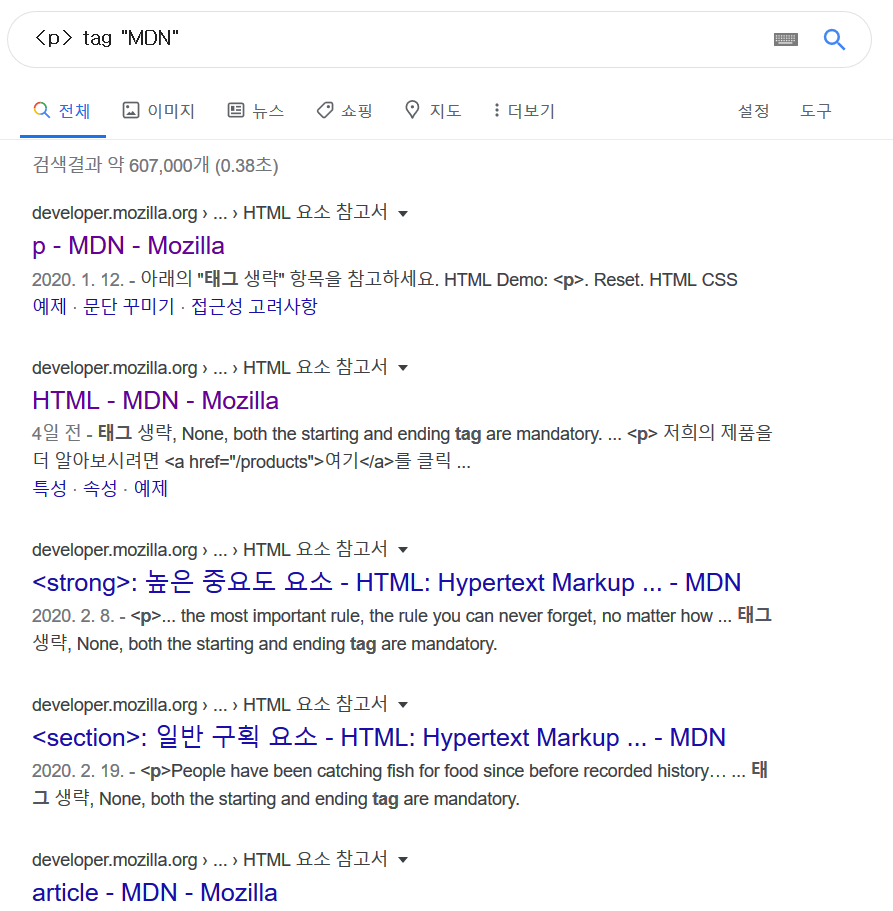

# 유용한 링크들

- 공부를 처음 시작하게 되면, 가장 큰 고민은 어디서 정보를 찾느냐는 것일 겁니다. 저희가 공부하면서 특히 유용했던 링크들을 모아놓았습니다.

## 뉴스테터

- 프론트엔드 분야는 발전도 빠르고 트렌드도 자주 변하기 때문에 최신 정보를 자주 접해야 합니다. 다음 링크들은 일주일 단위로 읽어볼 만한 글, 새로나온 디자인 등 좋은 정보를 제공합니다.
- RSS를 쓰거나 이메일을 통해 보는 것도 좋은 방법입니다.
- [Javascript Weekly](https://javascriptweekly.com/) : 자바스크립트에 관한 유용한 정보를 제공합니다.
- [Frontend Focus](https://frontendfoc.us/) : 프론트엔드 전반에 걸쳐서 유용한 글과 소식들을 전달해줍니다.
- [Node Weekly](https://nodeweekly.com/) : Node.js 에 관련 된 소식을 전달합니다. 개발에 유용한 패키지와 팁을 배울 수 있습니다. 나중에 백엔드에도 관심을 가지게 된다고 하더라도 여전히 유용한 정보를 제공합니다.
- [React Digest](https://reactdigest.net/) : 리액트에 관한 뉴스레터입니다.

## 공식문서

아마 여러분이 프론트엔드에 관해서 모르는 것을 검색하면 w3school의 문서가 제일 먼저 나오게 됩니다. 하지만 정보가 모자란 문서들이 많습니다. 특히 자바스크립트 쪽 문서가 심합니다. 여러분이 자바스크립트나 HTML, CSS에 대해서 모르는 내용이 있을 경우, 다음 사이트에서 검색하는 것을 추천드립니다.

- [MDN web docs](https://developer.mozilla.org/ko/) : 파이어폭스로 유명한 모질라 재단에서 작성한 자바스립트/CSS/HTML 문서입니다. 가장 정확하고, 예제와 설명이 풍부합니다.

- [리액트 공식 사이트](https://reactjs-kr.firebaseapp.com/) : 한국어 번역도 충실하고, 리액트를 시작하는 데 필요한 각종 정보를 제공해줘서 쉽게 사용할 수 있게 해줍니다.

## 커뮤니티

공식에서 올려준 정보만으론 모자랄 때가 많습니다. 질문을 하고싶은데, 질문을 어디다 해야할지 모를 때도 많습니다. 그럴 때는 이런 곳에 들어가시면 됩니다.


- [Stackoverflow](https://stackoverflow.com/) : 전 세계 개발자를 위한 Q&A 사이트입니다. 적절하게 질문을 올린다면 금세 답변이 달릴 것이고, 아니면 본인이 직접 답을 찾아서 작성할 수도 있습니다. 스택오버플로우에서 좋은 활동기록과 답변기록은 IT업계에서도 좋게 보니 적절히 이용해 주는 것이 좋습니다. 사용하기 전에, [좋은 질문을 작성하는 법](https://stackoverflow.com/help/how-to-ask)을 읽어보시길 바랍니다. 
- [Software Engineering Stack Exchange](https://softwareengineering.stackexchange.com/) : 스택오버플로우를 운영하는 스택익스체인지에서 운영하는 사이트입니다. 스택오버플로우가 실제 코드를 작성하면서 만나는 문제를 다룬다면, 소프트웨어 엔지니어링에서는 그 외 프로그래머가 만날 수 있는 문제들, 개발 방법, 소프트웨어와 관련된 법률적 문제, 알고리즘 등을 다루는 사이트입니다. 스택익스체인지에서는 이 외에도 다양한 QA사이트를 운영합니다.
- [프론트엔드개발그룹](https://www.facebook.com/groups/400867776724630/?ref=group_browse) : 프론트엔드 전반에 대해 다루는 한국인이 중심이 된 페이스북 그룹입니다. 전반적으로 자유로운 분위기이니 들어가서 봐보시길 바랍니다.
- [React Korea](https://www.facebook.com/groups/react.ko/?ref=group_header): 리액트 개발자를 위한 한국 그룹입니다. 또한 자체적인 슬랙채널도 운영하고 있고, 유명한 분들도 많이 있습니다.
- [Velog.io](https://velog.io) : velopert님이 개발하신 개발자를 위한 블로그 서비스입니다.

## 책

가끔은 공식 문서나 커뮤니티를 뒤지는 것보다 목차가 차근차근 안내된 책이 그리울 때가 있습니다. 유용하게 봤던 책들입니다.

- [velopert님의 모던 자바스크립트](https://learnjs.vlpt.us/) : 유료 온라인 강좌가 제공되는, 그리고 계속 업데이트 되는 e-book입니다. 유료강좌를 듣지 않아도 훌룡한 정보를 담고 있습니다.
- [이선 브라운님의 Learning JavaScript](https://www.aladin.co.kr/shop/wproduct.aspx?ItemId=112137604) : 일명 동물책으로 유명한 O'REILLY에서 나온 자바스크립트 서적입니다. 전체적인 자바스크립트 개발이 어떻게 이루어지는 다루고, 필요한 문법과 테크닉을 배울 때 굉장히 좋습니다. 
- [velopert님의 모던 리액트](https://react.vlpt.us/) : 이번에는 모던 리액트 강좌입니다. 역시 업데이트가 꾸준히 제공되며 실무적이고 인사이트를 기르는데 도움이 되는 프로젝트를 많이 다룹니다.
- [velopert님의 리액트를 다루는 기술](https://www.aladin.co.kr/shop/wproduct.aspx?ItemId=204819510) : 위 모던 리액트와 같은 저자분이 쓴 책으로, 실무적이고 상세한 정보를 제공해 줍니다. 종이책의 한계로 오타나 패키지의 업데이트로 변경된 정보는 직접 찾아서 써야합니다. 오탈자나 업데이트 된 정보는 velopert님의 [예제 소스코드 저장소](https://github.com/velopert/learning-react)에 올라옵니다.

## 튜토리얼

 나와있는 정보대로 따라하면서 정보를 습득할 수 있는 사이트입니다. 위에 MDN 사이트에서도 튜토리얼을 제공합니다.

- [입문자에게 추천하는 HTML, CSS 첫걸음 ](https://heropy.blog/2019/04/24/html-css-starter/): 한 번 읽어보시길 추천드립니다.
- [Poiemaweb](https://poiemaweb.com/) : HTML, CSS, JS 및 자주 쓰이는 기술들에 대해 튜토리얼을 제공해줍니다. JS의 최근 문법인 ECMAScript6부분을 집중적으로 봐주세요.
- [W3Schools](https://www.w3schools.com/) : 개발에 본격적으로 참고하기에는 내용이 빈약한 사이트이지만, 튜토리얼용으로는 괜찮습니다.

## 읽어 볼 만한 글

- [공개적으로 공부하라](https://velog.io/@kwanwooi/%EA%B3%B5%EA%B0%9C%EC%A0%81%EC%9C%BC%EB%A1%9C-%ED%95%99%EC%8A%B5%ED%95%98%EB%9D%BC) : 이걸 다 지킬 필요는 없어요. 빡세기도 하고, 이거 안해도 잘하시는 분이 많거든요. 그래도 자신이 무엇을 알고 있는 지를 알게 해주는 제일 좋은 방법 중 하나입니다.

## 구글링

검색을 할 때는 구글을 써야합니다. 그렇지만 구글에 익숙하지 않으면 꽤나 고생하실 거예요. 그래서 구글을 사용할 때 유용한 몇가지 팁을 알려드리려고 합니다.

### 명령어

 구글에서 제공하는 명령어는 종류가 다양합니다. 하지만 2가지 정도만 알면 찾는 데 크게 문제가 없습니다. 다른 유용한 명령어는 [이 곳](https://www.twinword.co.kr/blog/search-operator-complete-list/)을 참조해주세요.

- `- 키워드`: 검색 결과에 키워드가 포함된 내용은 제거하고 보여줍니다. 예를 들어 `<p>` 에 관련된 내용을 검색한다고 합시다. 다음처럼 W3SChool이 반겨줍니다.

    

    여기서 W3Schools의 내용을 제외하고 싶으면 아래와 같이 검색하면 됩니다.

    

- `"키워드"`: 특정 키워드가 반드시 포함된 내용을 검색하고 싶을 때 사용합니다. 예를 들어, 계속 `<p>`에 관련된 내용을 검색한다고 합시다. MDN에서 만든 문서만 보고 싶으면, 검색어에 `"MDN"`을 추가하면 됩니다. 그러면 MDN이라는 단어가 들어가 있는 검색 결과만 노출 됩니다.

    

### 검색어 찾기

 이건 팁이라고 하기도 그런데, 모르면 검색을 하기 힘듭니다. 여러분이 DS 과제를 하고 있고, 처음 자바를 사용하는 상황에서 다음과 같은 에러 메세지를 보았습니다.

```shell
Exception in thread &quot;main&quot; java.lang.NumberFormatException: For input string: &quot;잠와&quot;
	at java.base/java.lang.NumberFormatException.forInputString(NumberFormatException.java:68)
	at java.base/java.lang.Integer.parseInt(Integer.java:658)
	at java.base/java.lang.Integer.parseInt(Integer.java:776)
	at Ideone.main(Main.java:13)
```

여기서 문제원인을 찾으려면 어떻게 해야할까요? 다음 순서를 따라가 봅시다.

1. 일단 사용한 언어는 `java`입니다.
2. 발생한 에러는 `NumberFormatException`입니다.
3. 마지막으로 발생한 에러는 `parseInt`를 사용하는 중에 일어났습니다.

즉 이 세 정보를 조합해서 `java NumberFormatException parseInt`로 검색하면, 에러의 원인을 찾을 수 있습니다. 이렇게 검색해서 찾으면, `Integer.parseInt(string)`에 숫자로 바꿀 수 없는 문자열이 들어갔을 때 생기는 문제라는 걸 찾을 수 있습니다. 그러면 이 예외를 따로 처리해서, 문제가 생길 때는 다시 입력을 받도록 시키고 싶은데, 그럴 때는 어떻게 해야 할까요? 다시 검색어를 생각해봅시다.

1. 사용하는 언어 `java`
2. 다루고 싶은 것 `NumberFormatException`
3. 에러를 처리하고 싶은 거니 `error handling`

이렇게 검색하면 됩니다. 한국어로 검색할 때도 크게 다르지 않습니다.