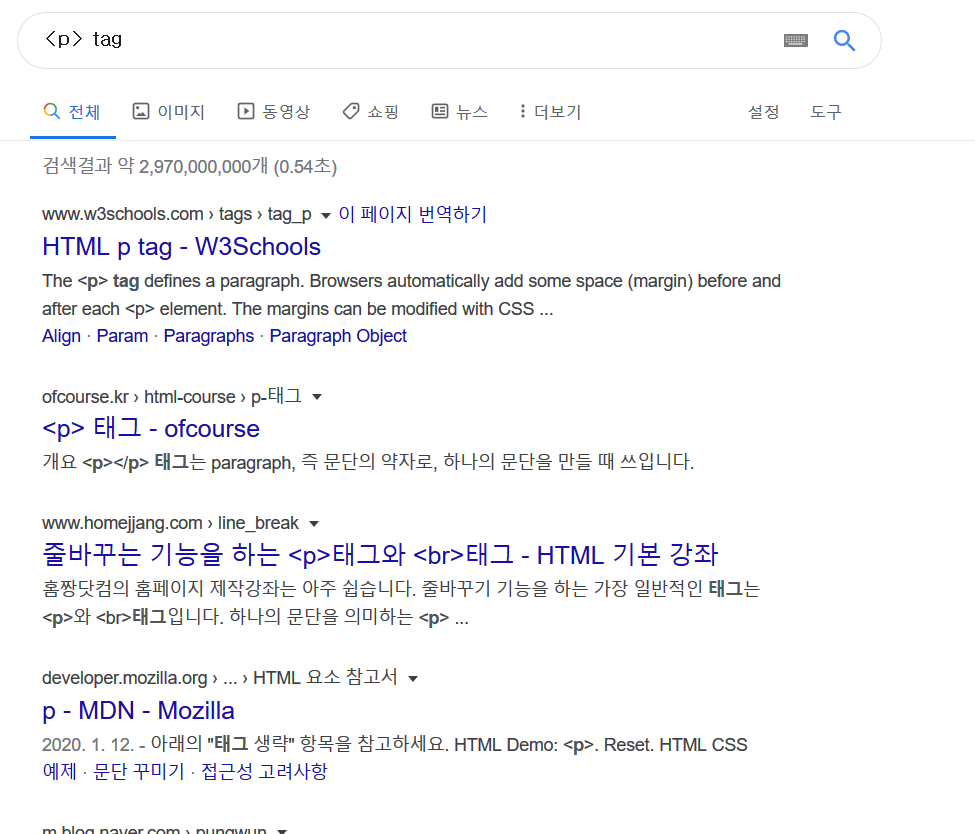

# HTML은 무엇일까요?

-   HTML은 'HyperText Markup Language'의 줄임말입니다. 이때, **HyperText**는 **웹에서 링크를 통해 다른 사이트나 문서로 이동하는 기능**을 말하고 **Markup**은 **태그들을 이용하여 문서의 구성요소들을 표기하는 것을 의미합니다.**
-   웹사이트를 제작할 때 뼈대를 구성하는 요소라고 볼 수 있습니다.
-   파일의 확장자로 **.html**을 사용합니다.

---

## HTML을 구성하는 태그들

### 1. 태그들의 특성

-   HTML 문서는 **태그(tag)들의 조합**으로 이루어져 있습니다.
-   태그들은 `<tag></tag>`의 형태를 취하고 있으며, 소문자를 사용하여 작성합니다.
-   **여는 태그와 닫는 태그**가 모두 필요합니다. 태그를 열기만 하고 닫지 않으면 오류가 발생합니다.

---

### 2. HTML 문서의 기본적인 구조

```html
<!DOCTYPE html>
<html lang="ko">
    <head>
        <meta charset="utf-8" />
        <title>HTML문서의 제목</title>
    </head>
    <body>
        <h1>HTML문서의 구조입니다!</h1>
        <p>문서 구조는 대략적으로 이렇습니다.</p>
        
    </body>
</html>
```

-   `<!doctype html>` - 문서의 유형을 알려주는 역할을 합니다. 웹 브라우저가 html문서를 html 문서라고 판단하여, 해석할 수 있게 해줍니다.
-   `<html>` 태그 - 문서의 본격적인 시작을 알려줍니다.
-   `<head>` 태그 - html에 CSS를 적용하기 위한 `<style>`태그나 `<link>`태그를 사용합니다.
-   `<meta>` 태그 - 인코딩 방식과 문서의 정보를 지정합니다.
-   `<body>` 태그 - 웹 브라우저에서 사용자들이 실제로 보는 내용들이 들어가는 태그입니다. 내부에 다양한 태그들을 포함할 수 있습니다.

---

## 3. HTML 태그 소개

### 3-1. 제목태그

`<h1>~<h6>` 태그가 있습니다.  
주로 제목을 나타낼 때 사용하는 태그로, h옆에 쓰인 숫자가 작을수록, 크고 굵은 제목을 쓸 수 있습니다. h1부터 h6까지 존재합니다.

```html
<!DOCTYPE html>
<html>
    <head>
        <meta charset="utf-8" />
        <title>HTML문서의 제목</title>
    </head>
    <body>
        <h1>h1</h1>
        <h2>h2</h2>
        <h3>h3</h3>
        <h4>h4</h4>
        <h5>h5</h5>
        <h6>h6</h6>
    </body>
</html>
```

<h1>h1</h1>
<h2>h2</h2>
<h3>h3</h3>
<h4>h4</h4>
<h5>h5</h5>
<h6>h6</h6>

---

### 3-2. div 태그

`<div></div>` 태그의 div는 Division의 약자로 웹사이트의 레이아웃(전체적인 틀)을 만들 때 주로 사용합니다. div 태그를 사용하여 각각의 블록(공간)을 알맞게 배치하고 CSS를 활용하여 스타일을 적용할 수 있습니다. 쉽게 생각하면 **영역을 구분해주는 태그**라고 볼 수 있습니다.

```html
<!DOCTYPE html>
<html>
    <head>
        <meta charset="utf-8" />
        <title>HTML문서의 제목</title>
    </head>
    <body>
        <div style="background-color:red">구역1</div>
        <div style="width:100px; height:100px; background-color:#CF0">구역2</div>
    </body>
</html>
```

<html>
<div style="background-color:red">구역1</div>
<div style="width:100px; height:100px; background-color:#CF0">구역2</div>
</html>
---

### 3-3. p 태그

p 태그는 단락을 지정하는 태그입니다.

```html
<!DOCTYPE html>
<html>
    <body>
        <p>
            Lorem ipsum dolor sit amet, consectetur adipiscing elit, sed do eiusmod tempor incididunt ut labore et dolore magna aliqua. Ut enim ad minim veniam, quis nostrud exercitation ullamco
            laboris nisi ut aliquip ex ea commodo consequat.
        </p>
        <p>
            Duis aute irure dolor in reprehenderit in voluptate velit esse cillum dolore eu fugiat nulla pariatur. Excepteur sint occaecat cupidatat non proident, sunt in culpa qui officia deserunt
            mollit anim id est laborum.
        </p>
    </body>
</html>
```

<p>Lorem ipsum dolor sit amet, consectetur adipiscing elit, sed do eiusmod tempor incididunt ut labore et dolore magna aliqua. Ut enim ad minim veniam, quis nostrud exercitation ullamco laboris nisi ut aliquip ex ea commodo consequat.</p>
<p>Duis aute irure dolor in reprehenderit in voluptate velit esse cillum dolore eu fugiat nulla pariatur. Excepteur sint occaecat cupidatat non proident, sunt in culpa qui officia deserunt mollit anim id est laborum.</p>

---

### 3-4. a 태그

a 태그는 다른 문서나 사이트로 갈 수 있는 하이퍼링크 기능을 가지고 있습니다. href attribute를 사용하면 이동하고자 하는 경로를 지정할 수 있습니다.

```html
<!DOCTYPE html>
<html>
    <body>
        <a href="http://www.google.com">Google</a>
    </body>
</html>
```

<a href="http://www.google.com">Google</a>

---

### 3-5. image 태그

image 태그는 HTML 문서에 이미지를 삽입하는 경우에 사용하는 태그입니다.  
attribute로 src, alt, width, height가 있습니다.

-   src에는 이미지 파일의 경로를 입력해야합니다.
-   alt에는 이미지 파일이 없거나 읽어오는 과정에서 문제가 발생하였을 경우 대신해서 표시되는 문장이 들어갑니다.
-   width와 height 값을 설정하여 이미지의 넓이와 높이를 지정할 수 있습니다.

```html
<!DOCTYPE html>
<html>
    <body>
        
        
    </body>
</html>
```

<html>


</html>
---

## 3-6. button 태그

button 태그는 사용자가 직접 클릭할 수 있는 버튼을 넣기 위한 태그입니다.

```html
<!DOCTYPE html>
<html>
    <body>
        <button type="button" onclick="alert('Hello World!')">Click Me!</button>

        <input type="button" value="Click Me!" onclick="alert('Hello world!')" />
    </body>
</html>
```

<html>
<button type="button">버튼입니다!</button>
</html>
