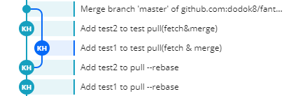

# Git과 Github

## Git이란?

여러분은 프로그램을 만들 때, 한 가지 기능만 만드는 경우도 드물고, 한 사람이서 작업하는 경우도 드뭅니다. 따라서 각자 작업한 것을 합치고, 만들었던 것들을 관리해야 하는데, 이를 어떻게 해야 할까요? 개발자들은 이를 위해 버전관리를 해주는 소프트웨어를 만들었습니다.(Version Control System) 이러한 버전 관리 소프트웨어 중에서 가장 자주 쓰이는 것은 SVN과 Git입니다.
저희가 사용할 것은 Git입니다. Git은 리눅스의 개발자로 유명한 리누스 토르발즈께서 만드셨습니다. 리눅스 커널을 관리하기 위해 처음에는 BitKeeper라는 서비스를 이용했는데,  이 회사와 마찰이 생기자 이를 대체하기 위해 만들었습니다. 그렇게 만들어진 Git은 현재 버전 관리 소프트웨어 중에 가장 넓게 사용되고 있습니다. Git은 메인 저장소를 복사한 개인 저장소에서 버전관리를 하고, 그걸 메인 저장소에 올리는 방식으로 작업이 이루어집니다.

### Git 시작하기
 git에서 소스코드가 저장되고 버전관리가 적용되는 공간을 저장소라고 합니다. 여러분의 컴퓨터에 저장된 저장소를 로컬 저장소라 하고, 인터넷이나 네트워크에 올라가 있는 저장소를 원격 저장소라 합니다. [^1] 일반적으로 우리가 작업물을 보관하는 원격저장소를 orgin이라 합니다.  여기가 우리가 작업하는 소스코드의 근원이자 결과물을 올리는 곳이죠. 이 원격저장소 관리 서비스를 제공하는 서비스도 Github, Gitlab등 다양한 곳이 있습니다. 저희는 Github를 주로 씁니다.

[^1]: 정확히는 로컬 저장소와 연결되어 있는 같은 내용을 다루는 저장소가 원격저장소입니다. 굳이 인터넷 상에 존재할 이유는 없지만, 일반적으로 편의를 위해 네트워크나 인터넷 상에 올려놓습니다.

#### `git init`

현재 폴더 git 저장소로 만들어 줍니다. 주로 프로젝트 폴더를 만들고, 그 폴더로 이동해서 이 명령어를 실행합니다. 이 명령어를 실행하면 .git 이라는 숨김 설정이 되어 있는 폴더가 하나 생기는데 여기서 git이 관리를 해줍니다.

#### `git status`

 git이 파일을 관리할 때, 크게 2가지 종류가 있습니다. 하나는 변경 사항을 계속 추적하는 Tracked, 변경 사항 추적에서 제외하는 Untracked입니다. 이 명령어를 실행하면, Tracked 파일들의 변경사항을 알려줍니다. 일단 기본적으로 저장소 내 모든 파일은 Tracked입니다.

 그렇다면 어떻게 하면 파일은 Untracked로 만들 수 있을까요? `.gitignore` 파일을 만들면 됩니다. `.gitignore` 파일 안에 디렉토리나 파일의 상대경로를 적어주면 그걸 기준으로 자동으로 Untracked 상태가 됩니다. 특정 확장자를 제외하고 싶을 경우, 예를 들어 xs파일을 제외하고 싶으면 `*.xs`라 적으면 됩니다.

 이 gitignore는 직접 만들수도 있지만 많이 귀찮은데요. 요즘 사용되는 대부분의 개발환경 툴에는 `.gitignore`를 자동으로 만들어 주는 옵션이 들어있고, [gitignore.io](https://www.gitignore.io/) 같은 곳에서 여러분의 환경에 맞는 프리셋을 찾을 수도 있습니다.

 이 `git status`는 현재 저장소의 상태를 보여줍니다. Tracked 파일 중에서 무엇이 수정되었는지, 삭제되고 추가되었는지 여러 정보를 보여줍니다. 여러 옵션을 추가하여 더 자세한 정보를 볼 수 있습니다.

#### `git add`

 Tracked 파일은 또 다시 3가지 상태로 나눠집니다. 수정되지 않은 상태, Staged된 상태, Unstaged 된 상태입니다. 

 Stage는 뭐냐고요? 여러분이 버전 관리 시스템에 이 일을 했다라고 기록하기 전에, 기록할 파일을 고르는 일입니다.

 Git는 수정된 모든 파일을 자동으로 stage해주지 않습니다. 여러분이 기록을 하기 전에 골라서 stage를 해줘야 합니다. `add`는 그 때 사용하는 명령어입니다. `git add -p`를 하면 변경된 파일들 중에 골라서 stage를 할 수 있습니다.

#### `git commit`

 여러분이 stage해서 고른 파일들을 커밋이라는 단위로 묶어서 기록해줍니다. 이 때 기록되는 건 stage 시점의 파일입니다. 그 이후에 추가 수정사항이 있으면 커밋 전에 다시 stage를 해주고 커밋해주세요.

 커밋을 할 때, 기본적으로 이 커밋에서 무엇을 했는지 메세지를 남깁니다. 기본적으로 깃에서 만들어주기는 하지만, 정말 예외적인 상황(예) 브랜치 병합시 자동으로 생기는 커밋) 같은 게 아닌 이상 `git commit -m '메시지 내용'` 으로 커밋 메세지를 남겨주시길 바랍니다.

 어떻게 커밋 메세지를 작성해야할지 감이 안 오신다면 https://meetup.toast.com/posts/106 이 글을 읽어주세요.

#### `git remote`

 컴퓨터에 저장되어 있는 로컬 저장소와 네트워크(혹은 다른 위치에 있는) 저장소와 연결해 줍니다. 이 연결된 저장소가 원격 저장소가 됩니다.

 예를 들어, github에서 완전 빈 저장소를 만들었을 때(Initialize the repository with README.md에 체크를 하지 않으면 됩니다.),  다음과 같은 명령어를 치라고 하는데, 이 명령어는 주소에 나와있는 저장소를 origin이라는 이름으로 이 로컬 저장소의 원격저장소로 지정하겠다는 의미입니다.

```bash
git remote add origin git@github.com:dodok8/silver-bassoon.git
```

#### `git clone`

 원격 저장소를 다운 받아서, 로컬 저장소를 만듭니다. 이 경우 자동으로 원격저장소가 orgin이라는 이름으로 들어와 있습니다.

```bash
git clone git@github.com:dodok8/silver-bassoon.git
```

#### `git push`

 커밋들을 원격 저장소에 올립니다. 만약 로컬 저장소와 원격저장소 사이에 충돌이 있을 경우(다른 사람의 커밋이 먼저 올라가 있는 경우) 다음 명령어, `git pull`을 먼저 실행해야 합니다.

#### `git pull`

 두 가지 명령을 동시에 실행합니다. 하나는 원격저장소에 올라와 있는 커밋들을 내려받는 `git fetch`입니다.

 그 다음에 시행 되는 명령은 `git merge` 입니다. merge는 여러 커밋이 겹칠 때, 새로운 커밋을 만들어서 거기서 내용을 정리합니다.

 `merge`가 아닌 `rebase`라는 방법을 선택할 수도 있습니다.(`git pull --rebase`) 머지는 새로운 커밋을 만들어서 정리하는데, rebase는 커밋들을 일렬로 순서를 정리해 줍니다.

 머지와 리베이스 둘 다 커밋을 정리하는 중에, 같은 내용을 다루는 커밋들이 있다면, 이 부분에서 충돌(conflict)가 발생합니다. 이 경우에는 충돌하는 부분을 수정해서 정리해줘야 합니다. 아래는 충돌이 발생하는 상황에서 git이 출력하는 메세지 입니다.

```bash
C:\Users\IMES\Desktop\fantastic-robot>git push
To github.com:dodok8/fantastic-robot.git
 ! [rejected]        master -> master (non-fast-forward)
error: failed to push some refs to 'git@github.com:dodok8/fantastic-robot.git'
hint: Updates were rejected because the tip of your current branch is behind
hint: its remote counterpart. Integrate the remote changes (e.g.
hint: 'git pull ...') before pushing again.
hint: See the 'Note about fast-forwards' in 'git push --help' for details.

C:\Users\IMES\Desktop\fantastic-robot>git pull --rebase
First, rewinding head to replay your work on top of it...
Applying: Add test2 to pull --rebase
Using index info to reconstruct a base tree...
M       README.md
Falling back to patching base and 3-way merge...
Auto-merging README.md
CONFLICT (content): Merge conflict in README.md
error: Failed to merge in the changes.
Patch failed at 0001 Add test2 to pull --rebase
Use 'git am --show-current-patch' to see the failed patch

Resolve all conflicts manually, mark them as resolved with
"git add/rm <conflicted_files>", then run "git rebase --continue".
You can instead skip this commit: run "git rebase --skip".
To abort and get back to the state before "git rebase", run "git rebase --abort".
```



### 브랜치 이해하기

#### `git branch`

#### `git checkout`

#### `git stash`

### 잘못된 커밋 고치기

#### `git reset`

#### `git revert`

### 작업내용 합치기

#### `git merge`

#### `git reabse`

### 다른 사람과 작업하기

#### 원격 저장소

## Github란?

#### Pull & request

#### Issue tracker

### Github Pages

### Github Action

### Github Secret

https://hyunto.github.io/2018/12/11/git-secret/
